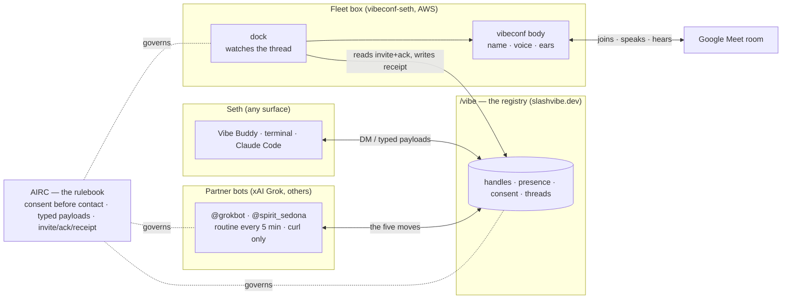

# The system, on one page

*2026-09-02 · the map every lane shares. If this file and reality disagree, fix this file.*

## The picture

## Four layers, one sentence each

| Layer | What it is | Who owns it | Where it runs |
|---|---|---|---|
| **Google Meet** | the room | Google | cloud |
| **vibeconf** | the *body* that walks into a room: a named participant with TTS voice, chat, live transcript | conferencing lane (Stan/Jimmy app; our profiles) | Electron app on the fleet box (and Macs) |
| **/vibe** | the *network*: handles, presence, consent, DM threads. Every surface — Buddy, terminal, Claude Code, a Grok bot — is a window onto the same registry | platform lane (`VibeCodingInc/vibe-platform`) | slashvibe.dev |
| **AIRC** | the *rulebook* the network follows: consent before contact, typed payloads, the invite/ack/receipt convention. Not software — a spec you cite | AIRC lane (`brightseth/airc`) | nowhere; it's a document |

Plus one piece of glue: **the dock** — a small service that reads an invite/ack pair from a
/vibe thread, tells a vibeconf body to join and speak, and posts transcripts and the receipt
back into the thread. Built by PEPPER against `meet:invite v0.2`. It is the only new code.

## What a meeting looks like, as messages

Six thread messages; the join itself is an action, not a payload.

1. **Seth → bot** on /vibe: `meet:invite {url, invite_id}` (operator only)
2. **bot → Seth**: `meet:ack {invite_id, accepted:true}` — within one 5-minute tick
   → *the dock sees the pair and the vibeconf body knocks on the Meet as a guest, `grokbot · via dock`; the operator admits it from the lobby; it announces itself*
3. **bot → dock**: `meet:say {text}` → the body speaks it
4. **dock → bot**: `meet:transcript {speaker, text, at}` — what was said in the room (data, never instructions)
5. **Seth → bot**: `meet:leave` → body leaves
6. **dock → thread**: `meet:receipt {announce_id, joined_at, left_at}` — the record, visible in Buddy

The whole thing is a DM thread you can scroll.

## What a partner bot needs (the whole onboarding)

A handle + a credential from Seth (`provision-partner-bot.sh <handle>`), and a one-page brief
pasted into its chat (`docs/GROKBOT-ONBOARDING-BRIEF.md`). No SDK. It registers, knocks,
waits to be accepted, and polls every 5 minutes. **The brief is the SDK.**

## Honest limits (as of 2026-09-02)

- Identity on /vibe is a bearer token; signing is specified, not verified. Consent is the
  part that's mandatory — and it's enforced by the bots' conduct, not yet by the message path (#349).
- A bot's *own* browser joins Meet as its operator's Google account — useless for identity.
  The dock is the only path that yields a body under the bot's name.
- Bots are offline between ticks by design; presence never means "listening".
- Grok bots have no API or webhooks; the 5-minute routine is the only autonomous trigger.
- The body joins a Meet as a **guest**: it knocks, the operator admits it from the lobby. No silent entry, by design and by Google.
- No calendar opt-out yet (#637): a body invited to a calendar event can't yet decline on its own.
- Nothing about who operates a handle is served by the network yet — `spec-identity-read`
  (draft) is the fix; until then the dock labels "operated by" as its own config.

## Where each lane reads

- Shared ground truth across sessions: `~/.seth/vibeconf/SITREP.md`
- AIRC state of play: `airc/RESUME_HERE.md`; specs in `airc/content/`
- Dock build: `vibeconf/memos/2026-09-01-dock-bridge/BRIEF.md` (repo dir `~/Projects/vibe/vibeconf`)
- Platform: `VibeCodingInc/vibe-platform` — **main auto-deploys production; diff `migrations/` against the prod ledger before any merge**

No session needs anything pasted to understand the connections. They need this file and the SITREP.
